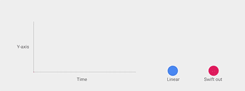
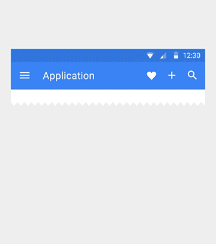

# UI-设计心得

##核心思想

就是把物理世界的体验带进屏幕。去掉现实中的杂质和随机性，保留其最原始纯净的形态、空间关系、变化与过渡，配合虚拟世界的灵活特性，还原最贴近真实的体验，达到简洁与直观的效果。

###材质载体（纸片）

纸片层叠、合并、分离，拥有现实中的厚度、惯性和反馈，同时拥有液体的一些特性，能够自由伸展变形。

###动画


>     动画不只是装饰，它有含义，能表达元素、界面之间的关系，具备功能上的作用。动画要贴近真实世界，就要重视easing(加速和减速过程)


| easing | relation |
|-------------| -------------|
|  |  |
| feedback | feedback2 |
|  |  |


###转场

| 通过过渡动画，表达界面之间的空间与层级关系，并且跨界面传递信息。| 从符界面进入到子界面需要抬升子元素的海拔，并展至整个屏幕，反之亦然 |
|:-------------:|: -------------:|
|  | |

###icon

小图标尺寸是24dp X 24dp。图形限制在中央20dp X 20dp区域内。

小图标同样有栅格系统。线条、空隙尽量保持2dp宽，圆角半径2dp。特殊情况相应调整。


###font

```
常用字号：

    12sp 小字提示
    14sp（桌面端13sp） 正文/按钮文字
    16sp（桌面端15sp） 小标题
    20sp Appbar文字
    24sp 大标题
    34sp/45sp/56sp/112sp 超大号文字

    长篇幅正文，每行建议60字符（英文）左右。短文本，建议每行30字符（英文）左右。
```

| Roboto(英文)       |      Noto(中文)      |
|:-------------:|: -------------:|
|      | |
|Roboto有6种字重：Thin、Light、Regular、Medium、Bold 和 Black。|Noto有7种字重：Thin, Light、DemiLight、Regular、Medium、Bold 和 Black。|

###buttons
| 悬浮按钮<br>(Floating action button) |浮动按钮<br>(Raised button)|扁平按钮<br>(Flat button)|
|:-------------:|: -------------:|: -------------:|
|点击后会产生墨水扩散效果的圆形按钮。<br>悬浮按钮有两种尺寸：56x56dp/40x40dp|点击后会产生墨水扩散效果的圆形按钮。|点击后产生墨水扩散效果，和浮动按钮的区别是没
有浮起的效果。|


###cards

| 卡片 |||
|:-------------:|: -------------:|: -------------:|
|||卡片统一带有2dp的圆角。|

###dialogs

| 卡片 |||
|:-------------:|: -------------:|: -------------:|
|||卡片统一带有2dp的圆角。<br>对话框上方不能再层叠对话框。<br>对话框可以是全屏式的，全屏对话框上方可以再层叠对话框。|

###menu

菜单到上下留出8dp距离


### Snackbars & toasts

| 卡片 |||
|:-------------:|: -------------:|: -------------:|
||||

###tabs

| tabs ||
|:-------------:|: -------------|
||tab文字要显示完整<br>字号保持一致<br>不能折行<br>文字与图标不能混用<br>tab选中项的下划线高度是2dp|

###Text fields
| 输入框 |||
|:-------------:|: -------------:|: -------------:|
||||

###tooltips
| 提示条 |||
|:-------------:|: -------------|
||提示不能包含富文本<br>不需要三角箭头|

###Navigation drawer

| Navigation |||
|:-------------:|:-------------:|:-------------|
||||手机端的侧边抽屉距离屏幕右侧56dp<br>菜单项不能换行|


###layout

```
1.所有可操作元素最小点击区域尺寸：48dp X 48dp。
2.栅格系统的最小单位是8dp，一切距离、尺寸都应该是8dp的整数倍。
```


| 一些常见的尺寸与距离       |            |
|:-------------:|: -------------:|
|顶部状态栏高度：24dp<br>Appbar最小高度：56dp<br>底部导航栏高度：48dp<br>悬浮按钮尺寸：56x56dp/40x40dp<br>用户头像尺寸：64x64dp/40x40dp<br>小图标点击区域：48x48dp<br>侧边抽屉到屏幕右边的距离：56dp<br>卡片间距：8dp<br>分隔线上下留白：8dp<br>大多元素的留白距离：16dp<br>屏幕左右对齐基线：16dp<br>文字左侧对齐基线：72dp| |
| | |


##参考
[material-design英文文档](http://www.google.com/design/spec/material-design/)

[material-design中文版文档](http://wiki.jikexueyuan.com/project/material-design/)

[material-design配色工具](http://www.materialpalette.com/)

[material-design设计创意](http://www.materialup.com/)
